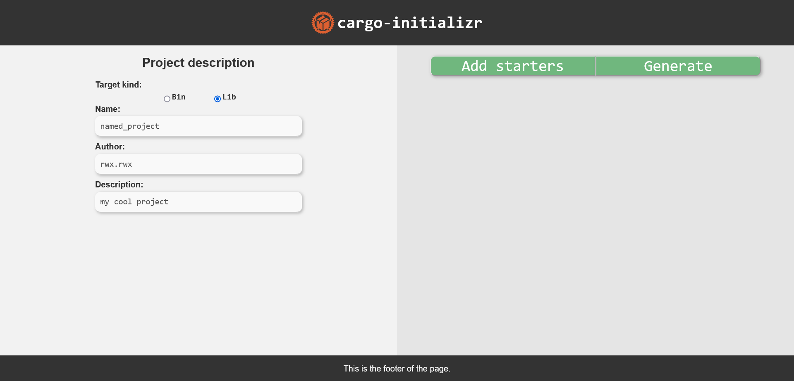
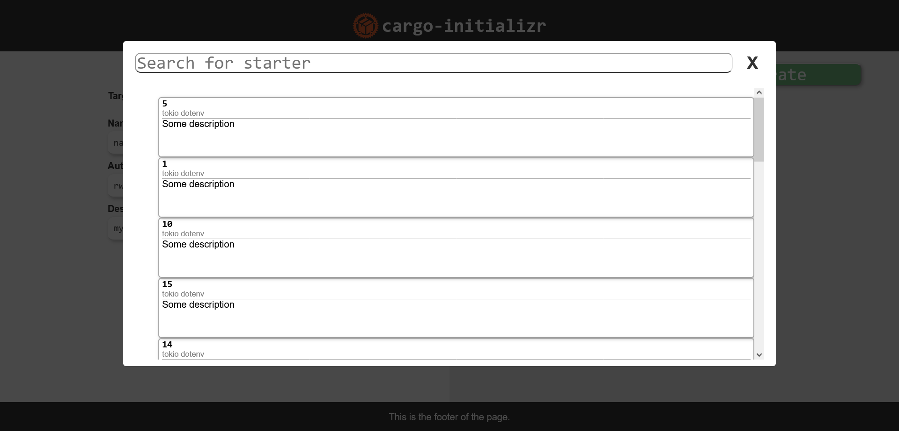
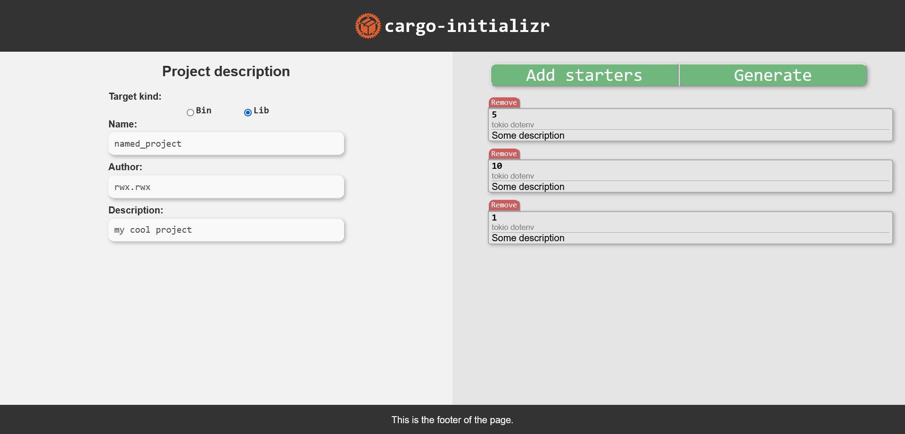

# cargo-initializr
It like Spring Initializr but for Cargo

:construction: Work in progres :construction:

# How to run it
1. Clone repository `git clone git@github.com:rwwwx/cargo-initializr.git`.  
2. Install `rust-script` and `trunk`:   
3. `cargo install rust-script` (Official page: [rust-script](https://rust-script.org/))  
4. `cargo install --locked trunk` (Official page: [trunk](https://trunkrs.dev/))  
5. Open `cargo-initializr/backend` folder and run `cargo run`.  
6. Open `cargo-initializr/frontend` folfer and run `./serve.ers`  
(Make sure you installed "trunk" and "rust-script").  
7. To test backend without web use [postman](https://www.postman.com/).  
You can [import](https://learning.postman.com/docs/getting-started/importing-and-exporting/importing-data/) postman collection from `cargo-initializr/backend/postman_requests` folder.

8. Enjoy :joystick::magic_wand::sparkles:

# Page examples:

